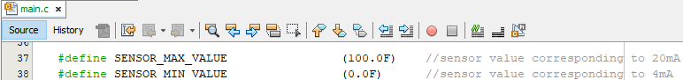

# 4-20 mA Current Loop Receiver using PIC16F17146 microcontroller

## Introduction
This example aims to simplify the 4-20 mA sensor interface using the rich set of analog peripherals such as Operational Amplifier (OPA), 12-bit differential ADCC, and Fixed Voltage Reference (FVR) of the PIC16F17146 microcontroller. The use of internal OPA and other analog peripherals helps to reduce BOM cost. Please refer to [4-20 mA Current Loop Basics](https://github.com/microchip-pic-avr-examples/pic16f17146-4-20-mA-receiver-mplab-mcc#4-20-ma-current-loop-basics) section to understand the basics of 4-20 mA current loop.

In this application, a resistor is used to sense the loop current and is connected to the internal OPA of the microcontroller, as shown in the above block diagram. The OPA module is used as a current to voltage converter which converts loop current to corresponding voltage levels. The output of OPA is fed to the ADCC module internally. FVR is used to provide stable voltage reference to the ADCC for accurate results. The ADCC result is then converted into a sensor parameter.

The sensors which have output in the form of 4 to 20 mA of current, typically requires loop voltage in the range of 10 V to 36 V for the operation. In this application, a boost click that has output over the range of 10 to 36V is used to provide the required loop voltage, as shown in the above block diagram. A proto click is used as a general-purpose PCB, which connects the resistor to the OPA terminals.

To demonstrate simulation of sensors, a 4-20 mA transmitter/sensor is implemented using PIC16F17146 Curiosity Nano board and various click boards. Please refer to the [4-20 mA Transmitter (Sensor)](https://github.com/microchip-pic-avr-examples/pic16f17146-4-20-mA-transmitter-sensor-mplab-mcc) for implementation details. Any available sensor with 4-20 mA current output can be interfaced with the 4-20 mA current loop receiver. Refer to [Considerations for Interfacing a 4-20 mA Current Sensor](https://github.com/microchip-pic-avr-examples/pic16f17146-4-20-mA-receiver-mplab-mcc#considerations-for-interfacing-a-4-20-ma-current-sensor) to see how to interface a 4-20 mA current sensor.

## Related Documentation
-	[PIC16F17146 Product Page](https://www.microchip.com/PIC16F17146)
-	[PIC16F17146 Data Sheet](https://www.microchip.com/DS40002343)

## Software Used
-	MPLAB® X IDE [6.00 or newer](https://www.microchip.com/mplab/mplab-x-ide)
-	Microchip XC8 Compiler [2.40 or newer](https://www.microchip.com/mplab/compilers)
-	MPLAB® Code Configurator (MCC) [5.1.17 or newer](https://www.microchip.com/mplab/mplab-code-configurator)
-	Microchip PIC16F1xxxx Series Device Support (DFP) [1.15.191 or newer](https://packs.download.microchip.com/)

## Hardware Used
-	[PIC16F17146 Curiosity Nano Board](https://www.microchip.com/en-us/development-tool/EV72J15A)
-	[Curiosity Nano Base Board](https://www.microchip.com/development-tool/AC164162)
-	[Boost Click](https://www.mikroe.com/boost-click)
-	[Proto Click](https://www.mikroe.com/proto-click)
-	Resistors (four 100kΩ and one 82Ω)

## Application Overview

In this application, the receiver performs two functions. One is to sense the current flowing through the loop and the other is to supply power to the loop. The following section explains, how these two functionalities are achieved with the help of an internal OPA module and click boards.

### Current Sensing

OPA is used in difference amplifier mode with gain 1, so the output of OPA is the same as the voltage drop across the reference resistor.

A sense resistor of value 84 Ω is used. Thus, according to ohm’s law, the output of OPA varies from 0.336 V to 1.68 V for 4 mA to 20 mA of current. The output of OPA is connected to one of the ADCC channels internally.

FVR provides a stable and accurate reference voltage for ADCC and it's output is set as 2.048 V. It helps in maximizing ADCC resolution as OPA output can go up to 1.68 V which corresponds to 20 mA current.

### Power Supply

In this application, the loop side of the transmitter (XTR116) is powered from the current loop itself. It requires a minimum of 7.5 V to operate. Thus, the power supply should be greater than 7.5 V. For this purpose, a boost click is used. The output of the boost is determined by the input voltage at the feedback (FB) terminal as shown in the below figure. Feedback voltage is controlled by DAC present on the click board. DAC output voltage is adjusted by the microcontroller’s SPI. Also, there is a provision to measure the output voltage of boost converter using ADC present on the click board, which can be read using SPI. The below diagram shows the internal blocks of boost click.

In this example, the output of boost click is set at 16 V. In most industrial applications the current loop is powered from 24 V. This is mainly because in such systems the 24 V power is already available and does not require an additional boost click.

### Maximum Length of The Loop

To determine the maximum length, first determine the resistance of the cables in the loop.

`V_boost = V_transmitter + V_linedrop + V_rsense`

`V_linedrop = V_boost - V_transmitter - V_rsense`

XTR116 which is present at loop side of transmitter needs at least 7.5 V from the loop to work correctly. Thus, the maximum voltage that could be afforded to be lost over the 4–20 mA bus is,

`V_linedrop = 16 - 7.5 - V_rsesne  =  8.5 - V_rsesne`  

The extreme situation is when the current through the loop is 20 mA. Using Ohm’s law to determine the resistance of the wires,

`R_loop (in ohm) = V_linedrop/(20 mA) = (8.5 – V_rsense)/0.02 = (8.5 – I_rsense * R_sense)/0.02 = (8.5 V – 0.02 A * 84 Ω)/(0.02 A) = (6.82 V)/(0.02 A)= 341 Ω`

Assume that a standard Cat5 UTP cable is used which is widely available. Depending on the manufacturer and cable quality, the resistance of cable is around 0.19 Ω /meter. Considering a pair of cables, the value are doubled.

`Maximum length possible (in meter)=  R_loop/(R_cable * 2) =  341/(0.19 * 2) = 897 m.`

Thus, data is transmitted over a distance of up to 900 m using standard UTP cable.

## Firmware Overview

The current flowing through the loop is measured continuously and converted to the sensor value. The converted sensor value is displayed on the terminal.  
The conversion from ADCC reading to sensor value can be split up into 3 steps.

**Step 1: Conversion of ADCC count to voltage**

`Voltage = ADCC Reference Voltage * (ADCC count)/(Highest ADCC count)`

Where,

ADCC reference voltage is 2.048 V.

Highest ADCC count is 4095 as the microcontroller has a 12-bit ADCC.

**Step 2: Conversion of voltage to current**

`Current (in mA) = Voltage/(Resistance * 1000)`

Where,

Sense Resistor of resistance 84 Ω is used in this example.

Voltage is calculated in step 1.

**Step 3: Conversion of current to sensor value (SV)**

`SV = (current - 4 mA) * (SV_20mA - SV_4mA)/(20 mA - 4 mA) + SV_4mA`

Where,

SV_20mA is sensor value corresponding to 20 mA.

SV_4mA is sensor value corresponding to 4 mA.

Current is calculated in step 2.

### Open Loop Detection
One of the points to note about the 4-20 mA loop is, the lowest signal is of 4 mA and not 0 mA. This can be used to detect one of the fault conditions in the loop which is the open loop condition. It involves loop breakage, which leads to no current in the loop. Current can be compared with 4mA and when the loop signal falls below this level, an error signal can be generated. For this purpose, ADCC is used in threshold mode in which the lower threshold corresponds to 4 mA and the upper threshold corresponds to 20 mA of current. When the current goes out of this limit hardware interrupt is generated by ADCC.

## Hardware Setup

## Hardware Connection
PIC16F17146 curiosity nano board is used as the development platform. Curiosity nano base board is used for connecting click boards to the nano board. Boost click and Proto click are placed in mikroBUS™ click slot 1 and 2, respectively. Proto click is used as a general-purpose PCB to connect the resistor to the OPA terminals. OPA is used in difference amplifier mode with a gain of 1. Refer to the below figure for proto click connection details. OPA is connected to ADCC internally without any external jumper cable.

## Pin Connection Table
| Microcontroller Pin |	Signal Description
| --- | -------------------
| RC6	| SPI SCK, BOOST SCK
| RC4	| SPI MISO, BOOST SDO
| RC5	| SPI MOSI, BOOST SDI
| RC7	| BOOST CS1 (DAC CS)
| RA2	| BOOST CS2 (ADC CS)
| RA5	| BOOST EN
| RC2 |	OPA Output 1
| RC3 |	OPA Non-Inverting Terminal
| RB4 |	OPA Inverting Terminal
| RB7	| EUSART1 TX

1Note: Connection from PIC16F17146 curiosity nano to click slot is not available for this pin. INT2 and AN3 of Curiosity Nano Base Board are shorted using jumper cable to make this connection.

**IMP :** Pull up resistor (R9) connected to SDA pin of Curiosity Nano Base Board needs to be removed to use the pin RB4 as OPA Inverting Terminal.

## Demo Operation
Current flowing through the loop is measured continuously and converted to the equivalent sensor parameter. The converted sensor parameter value is displayed on the terminal window.

The microcontroller sends data to the PC with the baud rate of 9600 using UART with the help of the virtual serial port feature of the on-board debugger. To see the messages in the terminal window, connect the curiosity nano board to any terminal emulator.

As the [4-20 mA Transmitter (Sensor) part](https://github.com/microchip-pic-avr-examples/pic16f17146-4-20-mA-transmitter-sensor-mplab-mcc) uses a temperature sensor, the temperature value is displayed. Along with temperature value, ADCC count, voltage reading value, and current reading value are displayed on the terminal window.

Remove any cable from the loop to form an open loop condition. The terminal shows an error message as shown in the figure below.

*Note: If any other sensor is used at the transmitter side remember to change macros in the  “main.c” file according to the sensor and its range. This should match with transmitter firmware or 4-20 mA sensor datasheet (if 4-20 mA sensor is used) for correct operation.*

## Peripheral Configuration using MCC
This section explains how to configure the peripherals using MPLAB X IDE with the MCC plugin for recreation of the project.

Refer [Software Used](https://github.com/microchip-pic-avr-examples/pic16f17146-4-20-mA-receiver-mplab-mcc#software-used) section to install required tools to recreate the project.

Additional Links: [MCC Melody Technical Reference](https://onlinedocs.microchip.com/v2/keyword-lookup?keyword=MCC.MELODY.INTRODUCTION&redirect=true)

##### Peripheral Configuration Summary
|    Module                  |    Configuration                                                                                                                                                                                                                                                                                                                                                       |    Usage                                                                   |
|--------------------------------|----------------------------------------------------------------------------------------------------------------------------------------------------------------------------------------------------------------------------------------------------------------------------------------------------------------------------------------------------------------------------|--------------------------------------------------------------------------------|
|    Clock Control           |    Clock Source   – HFINTOSC    HF Internal Clock – 4 MHz    Clock Divider – 4                                                                   |    System clock   |
|    OPA1                    |    Enable Op Amp    Op Amp   Configuration – Direct Connection to Pins  Positive Channel – OPA1IN+ Positive Source Selection – OPA1IN1+  Negative Channel – OPA1IN- Negative Source Selection – OPA1IN0-   |    Converts loop current to corresponding voltage level     |   
|    FVR                    |    Enable FVR    FVR_buffer 1 Gain – 2x    FVR_buffer 2 Gain – off       |    Provides stable voltage reference to the ADCC                                           |                                 
|    ADCC                    |    Enable ADCC    Input   Configuration –  Single Ended Mode    Operating   Mode – Busrt Average Mode    Result   Alignment – Right justified    Positive   Reference – FVR Acquisition Count – 50         Clock Source – FOSC  Clock Divider – FOSC/4      Error Calculation Mode – Filtered value vs setpoint    Threshold setpoint – 0  Threshold Interrupt Mode – ADERR < ADLTH or ADERR > ADUTH   Lower Threshold – 655  Upper Threshold – 3990   Repeat – 32   Accumulator Right Shift – 5    ADTI Interrupt Enable|    Monitors OPA output. Generates interrupt when current goes out of range                                          |
|    MSSP1                    |    Serial Protocol – SPI  Mode – Host SPI mode – SPI Mode 0 Input Data Sampled at – End  Clock Source Selection – FOSC/4         |    Communicates with Boost click                                                     |
|    EUSART1                 |    *UART1 Driver* Requested Baudrate –   9600  Enable Redirect   STDIO to EUSART      UART PLIB Selector – EUSART1   *EUSART1 PLIB*      Disable   Receive   Enable Transmit    Enable Serial   Port                                                                                                                                                                                              |    Sends data to   PC terminal                                              |

##### Peripheral Configuration using MCC

###### Clock Control

###### OPA1

###### FVR

###### ADCC

###### MSSP1

###### UART1 Driver

###### EUSART1 PLIB

*Note: The onboard debugger present on the curiosity nano board has a virtual serial port (CDC) that is connected to a Universal Asynchronous Receiver/Transmitter (UART) on the PIC16F17146 and provides an easy way to communicate with the target application through terminal software. Refer curiosity nano user guide for more details.*

###### Pins

###### Pin Grid View

## Summary
This code example demonstrated usage of analog peripherals such as Operational Amplifier, ADCC and FVR in 4-20 mA receiver application.

## Appendix

<b>4-20 mA Current Loop Basics</b>

To understand the 4-20 mA current loop lets tear down the whole system into different components and look at each of them separately. The below figure gives the pictorial representation of the 4-20 mA current loop system and its components.

#### Sensor

It measures process variable quantity such as pressure, temperature, humidity, flow etc. and provides its output to the transmitter.

#### Transmitter

Transmitter converts sensor measurement into a current signal. The sensor measurement range is mapped to 4 to 20 mA range. 4mA represents the lowest end of the measurement range and 20mA represents the highest end.
Most of the times sensor and transmitter part is combined and referred to as a 4-20 mA sensor. Thus, a 4-20 mA sensor has both a standalone sensor and transmitter in one package. Refer [4-20 mA Transmitter (Sensor)](https://github.com/microchip-pic-avr-examples/pic16f17146-4-20-mA-transmitter-sensor-mplab-mcc) for implementation of transmitter.

#### Power Source

A power source is essential to produce the current signal.  Many common voltages are used with 4-20 mA current loops such as 9, 12, 24 V. Voltage of power supply must be greater than the total voltage drop of the attached components (transmitter, receiver, and wire).

#### Receiver

The receiver receives and interprets the current signal. It converts current into equivalent sensor parameter. It can display sensor parameter on display, and take actions based on the signal depending on the end application requirement. This example covers the implementation of receiver.
  

<b>Considerations for Interfacing a 4-20 mA Current Sensor</b>

The changes required to use a 4-20 mA current sensor is explained below.

#### Hardware Modifications

The figure below shows the connection diagram for using a 4-20 mA sensor. The sensor uses 2-wire configurations as most of the sensors do. Refer to [4-20 mA Transmitter wiring](https://instrumentationtools.com/4-20-ma-transmitter-wiring/) for different configurations of 4-20 mA sensors. To power the current loop, 9-32V power supply available in the application environment can be used. If the required power supply is not available, then the boost converter can be used.

#### Software Modifications

The #defines, SENSOR_MAX_VALUE and SENSOR_MIN_VALUE correspond to sensor parameters at 20mA and 4mA respectively. These two #defines are present in the main.c file. These values must be changed according to the sensor used. Sensor datasheets mention these two values in the specification section.

